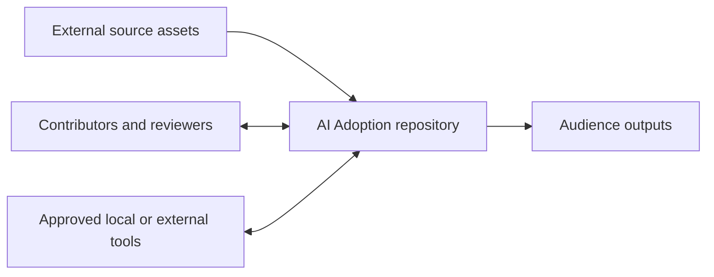

# Repository architecture

## Purpose and scope

This document defines the target architecture of the AI Adoption repository and
marks the implementation status observed in the repository. It is an operating
model for traceable information, not a statement that the complete pipeline
exists.

The object terms used here are defined in
[information objects and lifecycle boundaries](docs/concepts/information-objects.md).

Capability labels use the authoritative definitions in
[status values](docs/reference/statuses.md): `implemented`, `partial`, `planned`,
`absent`, and `unknown`. Narrative tables may expand `partial` to “partially
implemented” and `absent` to “not yet implemented.” Detailed evidence is in the
[repository baseline](project/status/repository-baseline.md).

## System context

Original source assets are maintained outside Git. Humans and approved tools
inventory and process them according to classification. The repository stores
approved metadata and derivatives, structured working knowledge, project
controls, and publication source material. Audiences consume reviewed reports,
presentations, or website outputs; those outputs do not replace their canonical
inputs.

Source assets remain outside the repository. Tool access depends on the source
classification and approved processing route. Authorized human reviewers
control approval of authoritative knowledge and organizational conclusions.

## Logical layers

| Layer | Responsibility | Principal target locations | Current status |
| --- | --- | --- | --- |
| 1. Source layer | Inventory original assets, classification, routes, hashes, and controlled extraction | `sources/`, `config/source-types.yaml`, `schemas/sources.yaml` | Partial |
| 2. Evidence layer | Store atomic, attributable evidence derived under an approved route | `knowledge/evidence/`, `schemas/evidence.schema.yaml` | Partial; nine records exist, three verified and six awaiting review |
| 3. Knowledge layer | Maintain concepts, claims, assumptions, decisions, and relationships | `knowledge/`, knowledge schemas | Partial; one use case is approved for its stated use, two remain drafts, and two provisional notes remain |
| 4. Assessment and outlook layer | Produce traceable current/target state, gaps, maturity, impact, and outlook content | `assessments/`, `outlook/` | Planned/scaffolded |
| 5. Project and progress layer | Maintain policies, decisions, reviews, status, risks, initiatives, metrics, and milestones | `project/`, `registers/` | Partial |
| 6. Publication layer | Assemble reviewed content for specific audiences | `publications/`, `website/` | Planned/scaffolded |
| 7. Presentation layer | Transform approved publication content into audience-specific decks | `presentations/` | Planned/scaffolded |
| 8. Automation and validation layer | Validate, process changes, trace impact, test, and generate derivatives | `scripts/`, `tests/`, `.github/` | Partial; validation, source-processing controls, source readers, and bounded relationship/impact traversal implemented; broader generation absent |

Layering controls dependencies: downstream content cites stable upstream IDs and
must not overwrite upstream records. A publication may summarize approved
knowledge; it must not become the only location of the supporting claim.

The version-controlled Codex prompt library under `prompts/codex/` is an
instruction asset within this layer. Its catalogue and metadata validator
govern repeatable agent work, but prompt text does not make a target workflow
operational or replace human review.

## Target information flow

**Source assets → metadata catalogue → content processing → atomic evidence →
structured knowledge → relationships and impact analysis → assessments and
progress views → reports → presentations**

The metadata step is implemented and controlled processing records four
technically verified runs. Stage 9 implements atomic-evidence and knowledge
contracts plus relationship integrity validation. Nine evidence records and
three semantic use-case records exist; the bounded Stage 10 chain is reviewed
and closed. That one approved use case does not establish broader authoritative
knowledge. Stage 11 implements bounded explicit-reference traversal and impact
integrity as a derived, read-only view; its exit gates are human-approved and
the roadmap records partial capability. Automatic invalidation, assessment
production, and output generation remain planned or absent.

See [information flow](docs/architecture/information-flow.md).

## Source-of-truth boundaries

| Information | Authority | Boundary |
| --- | --- | --- |
| Original source asset (original evidence) | Original asset in approved external storage | Local/external to Git; immutable during repository processing |
| Source metadata | `sources/catalogue.yaml`, by current policy | Git-tracked; must preserve IDs and provenance |
| Controlled values | `config/*.yaml` | Git-tracked; changes require documentation and review |
| Schema contracts | `schemas/` | Git-tracked; source and Stage 9 knowledge object schemas exist |
| Evidence and knowledge | Reviewed canonical Markdown and schema-valid registers | Git-tracked only when classification permits |
| Assessment and outlook | Reviewed canonical Markdown/structured records | Git-tracked; scaffolded today |
| Project state | `project/status/`, decisions, and applicable registers | Git-tracked; conflicts remain explicit |
| Publications and presentations | Generated or assembled derivatives | Must not replace canonical inputs |

The policy assignment of authority does not prove internal consistency. The
catalogue currently conflicts with the legacy source register, manifests, and
status notes about classifications and processing states. That conflict is a
review item, not permission to copy later values into the catalogue.

## Authoritative and generated data

Authoritative repository data is reviewed, provenance-preserving Markdown or
schema-valid YAML in its designated canonical location. An agent draft is not
authoritative merely because it is tracked. Generated data must identify its
inputs, generator and version, generation time, and review state when the
relevant contract is implemented.

Generated reports, slides, manifests, indexes, and graph projections are
replaceable derivatives. The source catalogue, evidence records, knowledge
records, approvals, and decisions are not replaceable build artifacts.

## Local-only and Git-tracked data

Original evidence remains under approved storage outside Git. Restricted or
otherwise non-trackable derivatives remain local-only. Git may contain metadata,
hashes, approved summaries, normalized knowledge, and outputs only when their
classification and handling route permit it. Generated content inherits the
highest classification of its inputs.

`.gitignore` excludes `sources/extracted/private/`, but ignore rules are not an
approval mechanism. Other paths require the same handling review.

## Human review points

Human review is required at least for:

1. classification and processing-route approval before body access;
2. extraction-tool approval where required;
3. promotion of extracted statements into atomic evidence;
4. approval of authoritative knowledge and conflict resolution;
5. current-state conclusions and target-state commitments;
6. organizational recommendations;
7. publication-ready executive claims and audience release.

Agents may prepare drafts and review packets but cannot self-approve these
states.

## Planned incremental update model

The target model detects a new or changed asset from identity, path metadata,
and content hash; preserves its stable source ID and history; determines
affected evidence and downstream objects from explicit references; reprocesses
only the affected path; invalidates or marks downstream items for review; and
regenerates approved derivatives after review.

No persistent dependency graph, change detector, invalidation engine, or
incremental runner exists in the current repository. The Stage 11 bounded,
in-memory relationship projection supports explicit-reference impact review;
acting on identified impact remains a manual, review-controlled procedure
described in [change management](docs/governance/change-management.md).

## Publication and presentation generation

The target publication pipeline selects reviewed content by audience,
classification, and claim status; assembles a report; validates provenance and
links; obtains human approval; then produces presentation and website
derivatives. Current directories document intent only. See the
[publication pipeline](docs/architecture/publication-pipeline.md).

## Architectural decisions

The accepted eight-layer target model is recorded in
[ADR 0001](project/decisions/0001-repository-operating-model.md). Existing
operative decisions evidenced by implementation or policy are recorded
separately so they do not imply that the full target architecture operates:

| Decision | Existing evidence | Future or incomplete capability |
| --- | --- | --- |
| [Source assets outside Git and metadata-only catalogue](project/decisions/ADR-0003-source-assets-outside-git.md) | External root, catalogue, schema, and source policy | Extraction and enforcement automation |
| [Markdown and YAML canonical formats](project/decisions/ADR-0004-markdown-and-yaml-canonical-formats.md) | Tracked documentation, configuration, source records, knowledge schemas/templates | Assessment/publication schemas and generators |
| [Stable identifiers](project/decisions/ADR-0005-stable-identifiers.md) | Project, source-root, source, and Stage 9 knowledge ID contracts | Assessment and publication identifier models |
| [Evidence and knowledge separation](project/decisions/ADR-0006-separate-evidence-and-knowledge.md) | Operating contract, policy, evidence schema, knowledge schemas, processing-run contract, review workflow | Successful reviewed runs and production evidence |
| [Human review for authority](project/decisions/ADR-0007-human-review-for-authority.md) | Operating contract and source-access gates | Repository-wide review workflow enforcement |
| [Publications as derivatives](project/decisions/ADR-0008-publications-are-derivatives.md) | Source-of-truth and publication boundary documentation | Publication and presentation generation |
| [Documentation as implementation](project/decisions/ADR-0009-documentation-is-part-of-implementation.md) | Agent and contribution contracts | Automated documentation completeness checks |
| [Explicit relationship traversal](project/decisions/ADR-0011-explicit-relationship-traversal-contract.md) | Accepted directions, lifecycle, depth, cycle, impact, canonical-data contract, and Stage 11 implementation | Later Stage 16 invalidation/regeneration |

ADRs 0005–0007 were accepted by Maksim Zakharenkau on 2026-08-02 as part of
Stage 9 closure; ADR 0010 was accepted with source-state reconciliation later
that day. ADRs 0001, 0003–0004, and 0008–0009 were then accepted with their
explicit limitations. ADR 0011 was accepted by MZ on 2026-08-14 before Stage 11
implementation. Record status does not change the implementation
boundaries shown above.
