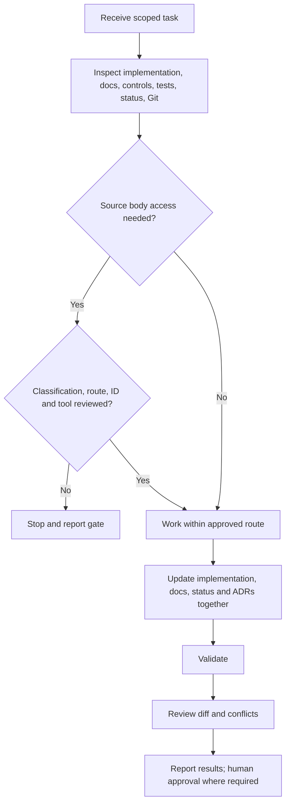

# Agent operating model

The authoritative rules are in [AGENTS.md](../../AGENTS.md). This document
explains how those rules form a working lifecycle.

## Task lifecycle

## Roles and authority

| Role | May do | Must not do alone |
| --- | --- | --- |
| AI agent | Inspect metadata and repository content, implement scoped changes, draft analysis, propose decisions, run validation | Approve authoritative knowledge, policies, organizational conclusions, commitments, executive claims, or bypass source handling |
| Contributor | Create and review changes within assigned access | Treat source access as publication approval |
| Authorized human reviewer | Approve the controlled decisions within their mandate | Remove provenance or silently rewrite conflicting evidence |
| Repository maintainer | Manage branches, merge reviewed work, maintain controls | Treat a merge as evidence approval unless that approval is explicitly recorded |

## Inspection and planning

An agent first distinguishes observed facts from assumptions. A directory name
or README is evidence of intent, not implementation. Before editing, the agent
checks relevant code or content, documentation, schemas, configuration,
validation, project status, branch, status, and diff.

Material conflicts are reported according to the instruction precedence in
`AGENTS.md`. The agent does not resolve data conflicts merely to make validation
pass.

## Change set completeness

A complete stage change keeps four records synchronized:

1. implementation or canonical content;
2. authoritative documentation;
3. a stage status document under `project/status/`;
4. an ADR under `project/decisions/` when the design choice is material.

The change also updates tests and validation appropriate to its risk. If these
mechanisms do not exist, their absence is reported.

## Review and handoff

The agent labels drafts and avoids asserting human approval. Before handoff it
runs applicable validation, inspects the diff, and reports files inspected,
created, modified, and deleted; decisions; documentation; validation and tests;
unresolved issues; and the recommended next action.

Agents do not commit, push, merge, rewrite history, delete branches, or modify
unrelated files without explicit instruction.

## Limitations

The repository has no machine-enforced agent workflow. Knowledge review,
processing-run, and provenance schemas/validators now enforce record integrity,
but human authority, content correctness, and handling-environment facts remain
documentation- and review-driven.
