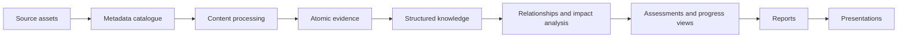

# Information flow

## Target flow

In prose, original assets are inventoried without changing them. Approved
processing creates attributable units of evidence. Reviewed evidence supports
structured knowledge. Explicit relationships make change impact and graph views
possible. Reviewed knowledge supports assessments and project views, which are
selected and shaped for reports and presentations.

This is the target flow. Metadata inventory, processing authorization/run
controls, and the empty evidence/knowledge framework are implemented; no
successful run or production content exists.

The distinctions between source metadata, extraction, evidence, knowledge,
canonical records, and generated derivatives are defined in
[information objects](../concepts/information-objects.md).

## Stage contracts

| Stage | Input | Output | Required control | Current status |
| --- | --- | --- | --- | --- |
| Source assets | Files in approved external storage | Immutable original | Classification and handling boundary | External dependency indicated by policy and metadata; bodies not verified in this review |
| Metadata catalogue | Filesystem metadata and hashes | Stable source records | Source ID, path, hash, classification, route | Implemented and explicitly reconciled; historical views remain non-canonical |
| Content processing | Approved source and tool | Classified extraction with provenance | Route/tool approval and processing run record | Partial; 57 authorizations and one successful private pilot derivative awaiting human review |
| Atomic evidence | Approved extraction | One attributable statement or observation per record | Evidence schema, source locator, reviewed run, review state | Partial; empty controlled framework and run-integrity validation, no records |
| Structured knowledge | Reviewed evidence | Terms, concepts, frameworks, metrics, risks, trends, use cases, assumptions, decisions | Object schemas and human approval | Partial; schemas/templates/validation exist, directories empty |
| Relationships and impact | Structured IDs and typed links | Validated relationship records; future graph projection and affected-object set | Relationship schema and integrity validation | Partial; record validation exists, traversal absent |
| Assessments and progress | Reviewed knowledge and project records | Current/target state, gaps, maturity, delivery views | Method, scoring contract, reviewer | Planned/scaffolded |
| Reports | Approved content selected for an audience | Audience report | Claim, provenance, classification, and audience checks | Planned/scaffolded |
| Presentations | Approved report content | Audience deck | Traceability to report and review gate | Planned/scaffolded |

## Provenance chain

Every downstream object should eventually record:

- its stable identifier and object type;
- upstream IDs and precise source locators where applicable;
- creation method, tool or agent, and time;
- classification inherited from inputs;
- draft/review/approval state and reviewer;
- version or supersession relationship;
- downstream references where the model supports them.

The source and source-processing schemas cover metadata, authorization, and run
provenance; Stage 9 schemas cover the evidence and knowledge fields above.
Assessment and publication contracts do not yet exist. The two
legacy/provisional synthesis notes do not conform to these contracts.

## Conflict flow

Conflicting sources or interpretations do not collapse into one value
automatically. Each attributed position remains visible, a conflict record or
review issue links them, and an authorized human records any resolution. The
superseded item remains traceable.

## Planned incremental flow

1. Detect a new, removed, moved, or content-changed source through inventory and
   hash comparison.
2. Preserve the source ID when identity rules show it is the same asset; record
   path and hash history.
3. Traverse explicit downstream references to identify affected evidence,
   knowledge, assessments, reports, and presentations.
4. Reprocess only through the approved route.
5. Mark affected downstream objects stale or in review.
6. Obtain required human approvals.
7. Regenerate replaceable derivatives and validate the provenance chain.

No automated implementation currently performs these steps.
