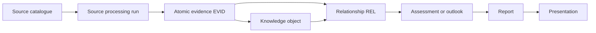

# Knowledge flow architecture

The catalogue supplies stable source identity and metadata. A controlled run
produces a derivative; a reviewer promotes individual attributable statements
to evidence. Knowledge objects interpret evidence. Explicit relationships
connect existing knowledge-object IDs so later impact analysis can follow
dependencies. Assessments and outlooks apply methods and judgment, while
reports and presentations remain generated or assembled derivatives.

Stage 9 implements controlled knowledge types, evidence and object schemas,
templates, integrity validation, review controls, and CI. The approved
post-Stage-9 controls add the processing-run register and text/HTML and PPTX
readers.
Four runs are technically verified, nine evidence records and three use-case
records validate, and one bounded Stage 10 chain is reviewed and closed. Stage
11 adds an in-memory explicit-reference projection, bounded traversal, impact
validation, and synthetic tests; its exit gates are human-approved, its
capability remains partial, and there are no production `REL` records. Other
format readers, assessment schemas, report/presentation generators, and
automatic invalidation remain absent.

The accepted
[explicit relationship traversal contract](../../project/decisions/ADR-0011-explicit-relationship-traversal-contract.md)
defines the approved direction, depth, cycle, repeated-node,
missing/deprecated-object, conflict, and canonical-boundary rules for Stage 11.
MZ accepted it on 2026-08-14. The resulting Stage 11 implementation is a
derived navigation and integrity capability; canonical knowledge records remain
authoritative. MZ approved the implementation exit gates on 2026-08-14.
