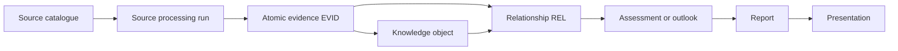

# Knowledge flow architecture

The catalogue supplies stable source identity and metadata. A controlled run
produces a derivative; a reviewer promotes individual attributable statements
to evidence. Knowledge objects interpret evidence. Explicit relationships
connect existing knowledge-object IDs so later impact analysis can follow
dependencies. Assessments and outlooks apply methods and judgment, while
reports and presentations remain generated or assembled derivatives.

Stage 9 implements controlled knowledge types, evidence and object schemas,
templates, integrity validation, review controls, and CI. The approved
post-Stage-9 controls add the processing-run register and a text/HTML reader;
the register is empty and other extraction wrappers, dependency traversal,
assessment schemas, and report/presentation generators remain absent. Changes
therefore require a manual search for affected `EVID` and knowledge IDs until
incremental automation exists.
