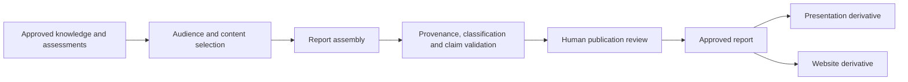

# Publication pipeline

## Scope

This document describes the intended production of audience-specific reports,
presentations, and website output. It is a target pipeline. The repository has
directory scaffolds but no demonstrated assembler, renderer, or publication
validator.

## Target pipeline

## Inputs and outputs

Inputs are approved knowledge, assessments, progress records, audience
definitions, publication templates, and presentation themes. Outputs are
audience-specific report sources and replaceable rendered artifacts. A
presentation is derived from an approved report or the same approved canonical
content; it must not introduce unsupported executive claims.

`config/audiences.yaml` contains only review-only `AUD-000001`, and
`config/scoring_models.yaml` records an unscored initial assessment mode with no
models. Publication and presentation subdirectories contain no templates or
generators.
Accepted
[ADR-0012](../../project/decisions/ADR-0012-assessment-scoring-and-audience-controls.md)
defines the control framework and stable identifier forms; it does not approve
a scoring model or configuration record. `AUD-000001` is approved only for
internal assessment review of `public` and `internal` material; it grants no
publication or external-release authority.

## Required controls

Before publication automation is operational, it needs:

- an audience schema and approved audience records;
- publication and presentation object identifiers;
- explicit inclusion rules for classification and approval status;
- templates with version identifiers;
- traceability from each material claim to canonical knowledge and evidence;
- validation for unresolved conflicts, missing provenance, and prohibited
  classifications;
- a recorded human reviewer and approval time;
- reproducible generator commands and tests;
- clear rules for retention, supersession, and generated-output cleanup.

## Review points

Human approval is required for authoritative conclusions, target commitments,
organizational recommendations, and publication-ready executive claims.
Audience fit review does not replace evidence or classification review.

## Generated-output boundary

Rendered reports, slide decks, and sites are derivatives. Canonical claims,
evidence, approvals, and decisions remain in their upstream Markdown or
structured records. A generated artifact may be rebuilt or replaced without
changing the identity of its canonical inputs.

## Current status

- `publications/`: purpose README and audience directories only — planned.
- `presentations/`: purpose README, empty source/theme directories, and ignored
  generated-output area — planned.
- `website/`: purpose README only — planned.
- `config/audiences.yaml`: one schema-validated internal review audience; no
  publication or external-release audience.
- publication/report/presentation scripts and tests: absent.
